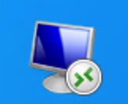
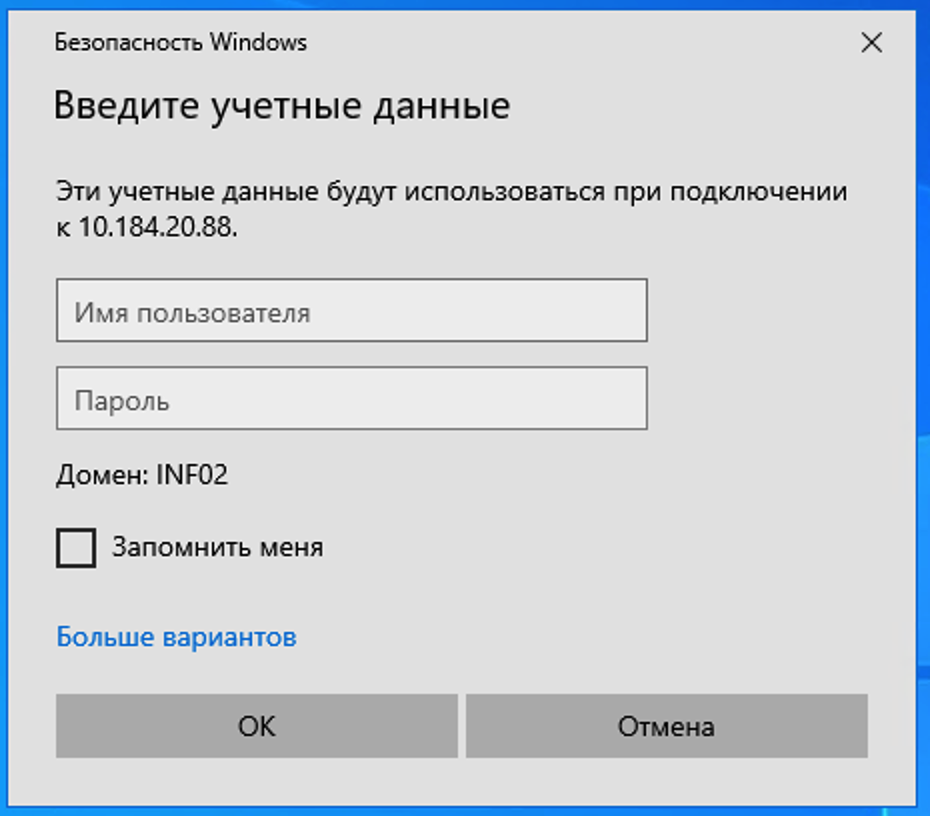
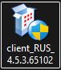

# База знаний Cofi

  Внутренние инструкции и памятки: обзор раздела, удалённый рабочий стол и ViPNet Client.

  <a class="kb-tile" href="instructions/">
    

      
    

    

      Инструкции
      Обзор раздела и все материалы
    

  </a>
  <a class="kb-tile" href="instructions/remote-desktop/">
    

      
    

    

      Удалённый рабочий стол
      RDP и формат учётной записи
    

  </a>
  <a class="kb-tile" href="instructions/vipnet-client-windows/">
    

      
    

    

      ViPNet Client на Windows
      Установка, ключи и первый вход
    

  </a>

